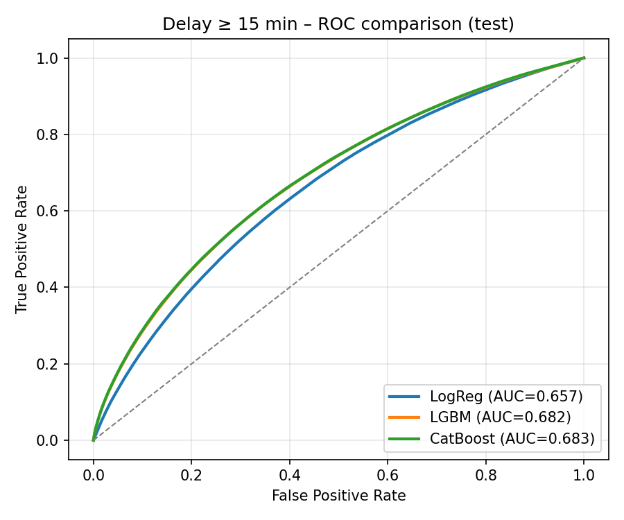

# FlightDelayAdvisor

[](https://github.com/abdullahuseyinli-dot/FlightDelayAdvisor/actions/workflows/tests.yml)

FlightDelayAdvisor estimates delay and cancellation risk for US domestic
flights. A Streamlit interface combines calibrated tabular models with route,
airline, congestion, calendar, and monthly weather features to support
scenario comparison rather than a single opaque prediction.



## Scope

- Historical source: US Bureau of Transportation Statistics on-time data,
  2010–2024.
- Targets: arrival delay of at least 15 minutes and flight cancellation.
- Models: logistic regression, LightGBM, CatBoost, and a tabular neural network,
  with probability calibration and feature ablations.
- Product surface: single-flight risk estimates, departure-time comparisons,
  airline comparisons, airport summaries, and route alternatives.
- Temporal check: a separate out-of-time evaluation on 2025 BTS records.

## Recorded results

The in-period values below come directly from
[`reports/metrics_summary.txt`](reports/metrics_summary.txt). They use the fixed
test split and calibrated probabilities; threshold-dependent classification
scores are available in the same artifact.

| Target | Selected model | ROC-AUC | PR-AUC | Brier score |
| --- | --- | ---: | ---: | ---: |
| Delay ≥ 15 minutes | CatBoost | 0.6864 | 0.3819 | 0.1587 |
| Cancellation | LightGBM | 0.7061 | 0.1089 | 0.0171 |

The tracked 2025 summary is an out-of-time check, not a second tuning set.

| Target | Evaluated rows | Base rate | ROC-AUC | PR-AUC | Brier score | Top-decile rate |
| --- | ---: | ---: | ---: | ---: | ---: | ---: |
| Delay ≥ 15 minutes | 196,693 | 0.2287 | 0.6469 | 0.3460 | 0.1703 | 0.4190 |
| Cancellation | 200,000 | 0.0165 | 0.6543 | 0.0368 | 0.0165 | 0.0435 |

See [`reports/backtest_2025_metrics.txt`](reports/backtest_2025_metrics.txt) for
the promoted summary. The retained `backtest_2025_log.txt` records a separate,
earlier 500,000-row run and is deliberately not mixed with the table above.

## Design

```text
BTS monthly files + airport weather
              │
              ▼
     cleaning and feature engineering
              │
              ▼
 temporal split → model training → probability calibration
              │                         │
              ├──────── evaluation ─────┘
              │
              ▼
   versioned artifacts → Streamlit application
```

The application reuses the same feature schema and aggregate metadata as the
training pipeline. Model and dataset paths are centralized in
[`config/model_paths.yml`](config/model_paths.yml).

## Run the application

The curated parquet dataset and deployed model files use Git LFS.

```bash
git lfs install
git clone https://github.com/abdullahuseyinli-dot/FlightDelayAdvisor.git
cd FlightDelayAdvisor
git lfs pull

python -m venv .venv
# Windows: .venv\Scripts\activate
# macOS/Linux: source .venv/bin/activate
python -m pip install --upgrade pip
python -m pip install -r requirements.txt
streamlit run app.py
```

The first application load builds in-memory route, airline, congestion, and
weather aggregates from the materialized parquet file. Startup therefore takes
longer than subsequent cached interactions.

## Reproduce the pipeline

Each stage is kept as an explicit script under `src/`:

```bash
python src/download_bts.py
python src/prepare_dataset.py
python src/download_airport_weather.py
python src/add_weather_to_dataset.py
python src/train_models.py
python src/evaluate_models.py
```

The 2025 temporal check has its own preparation and evaluation stages:

```bash
python src/prepare_bts_2025_for_backtest.py
python src/backtest_2025_from_processed.py
```

These commands are compute- and storage-intensive. They overwrite generated
local outputs only; the tracked summaries remain the reviewable release
evidence.

## Quality checks

Fast checks do not download LFS objects:

```bash
python -m compileall -q app.py src tools tests
python -m pytest -q tests/test_prepare_2025.py
python tools/validate_repository.py
```

Artifact-backed regression tests require `git lfs pull` and the runtime
dependencies:

```bash
python -m pytest -q -m integration
```

## Repository layout

```text
.
├── app.py                         # Streamlit application
├── config/                        # Artifact path configuration
├── data/
│   ├── processed/                 # Curated LFS dataset
│   └── raw_2025/                  # Retained monthly backtest inputs
├── models/                        # Calibrated LFS model artifacts
├── reports/                       # Metrics, drift/fairness tables, and figures
├── src/                           # Download, preparation, training, and evaluation
├── tests/                         # Fast schema and opt-in integration tests
└── tools/                         # Repository release validation
```

## Limitations

- The system estimates historical statistical risk; it is not a guarantee of a
  particular flight outcome or a substitute for live airline information.
- Cancellation is rare, so ROC-AUC alone can be misleading. PR-AUC, Brier score,
  base rate, and concentration metrics are reported alongside it.
- Monthly climatology cannot represent a live storm or operational disruption.
- Performance declines on the 2025 temporal check, indicating distribution
  shift and the need for monitoring before operational use.
- Route and airline aggregates can be sparse for uncommon combinations; the UI
  surfaces fallback behavior and supporting sample counts.

## License

Released under the [MIT License](LICENSE). BTS and weather source data remain
subject to their respective provider terms.
