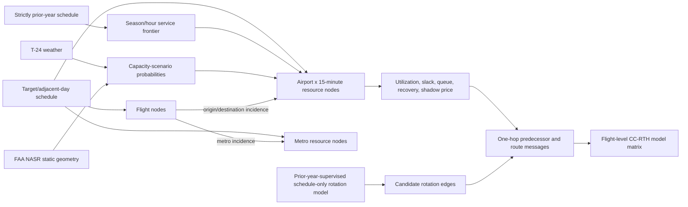

# CC-RTH: Capacity-Conditioned Resource-Time Flight Hypergraph

> Historical generation: the later cutoff audit withdrew the release candidate's
> strict T−24 claims. Recorded scores and checks below retain their original scope;
> they do not establish corrected forecast performance. See
> [current status](PROJECT_STATUS.md) and [current results](CURRENT_RESULTS.md).

## Purpose

CC-RTH is the implemented airport-resource evolution of FLARE-24. It represents a flight not only by its route, weather, and historical context, but by the shared airport systems it is scheduled to occupy. The central hypothesis is that delay risk partly emerges from interactions among flights competing for time-local arrival, departure, runway-system, and metropolitan resources.

This is a retrospective research benchmark. It does not claim that BTS contains a live schedule snapshot, an observed gate assignment, a realised runway configuration, an airport acceptance rate (AAR), or an airport departure rate (ADR).

## Information boundary

For a target flight with scheduled departure time (t_i), the declared cutoff is (t_i-24\,h). Graph construction reads only:

- target and adjacent-day schedule fields;
- cutoff-coherent FLARE-24 weather forecasts;
- a cycle-dated FAA NASR static runway catalogue;
- an empirical scheduling frontier estimated exclusively from target year minus one;
- a latent-rotation model supervised in target year minus one and inferred from target-year schedules without target-year tail numbers; and
- optional operational constraints only when their issue timestamp is no later than the flight cutoff.

Target outcomes, realised weather, taxi variables, actual times, and target-year tail identifiers are excluded from graph construction. The feature registry in `flare_capacity_contracts.py` makes this boundary executable.

## Hypergraph

The materializer emits four sparse tables as well as a sample-keyed model matrix:

1. **Flight nodes.** One node per scheduled flight.
2. **Airport resource-time nodes.** Airport × 15-minute nodes representing the arrival/departure runway system around the scheduled event time.
3. **Metro resource-time nodes.** Shared nodes for prespecified multi-airport systems (for example NYC, Chicago, the Bay Area, and the Los Angeles basin).
4. **Edges.** Flight-to-origin-resource, flight-to-destination-resource, optional flight-to-metro incidence, and probabilistic predecessor-to-successor rotation edges.

Node identifiers are deterministic hashes of resource type, resource key, and UTC bucket. Every flight must connect to at least its origin and destination airport-time resources. Candidate rotation mass into a successor is bounded by the latent matching model.

Monthly partitions retain rotation predecessors from the adjacent-day context. Such a predecessor can live in the preceding month rather than in the current partition's flight-node table; the edge is preserved, and the model emits an explicit resource-message coverage value instead of pretending that an unresolved predecessor state was observed.

## Demand and empirical service frontier

For each arrival and departure event, CC-RTH calculates same-airport arrival, departure, and total movement counts in centered 15, 30, 60, and 120-minute windows. It also calculates leave-one-flight-out pressure, time to neighboring same-direction flights, arrival/departure imbalance, short-window burstiness, and metro-system pressure.

The service frontier is estimated from strictly prior-year schedules. Within airport, local season, local hour, and direction, daily hourly counts yield the 50th, 75th, and 90th percentiles. Those hourly values are converted to 15-minute service units. Sparse cells use an airport/hour backoff. These are relative empirical scheduling envelopes—not physical throughput estimates.

## Weather- and geometry-conditioned scenarios

Each event has three latent capacity scenarios:

- constrained: prior-year p50 scheduling frontier;
- marginal: prior-year p75 frontier; and
- good: prior-year p90 frontier.

T−24 convection, icing environment, precipitation, visibility, gust excess, and wind-optimal crosswind are combined into a bounded weather-stress score. Wind direction and static runway-end headings produce soft runway feasibility, effective usable-end count, and configuration entropy. A softmax of weather stress and runway feasibility assigns probabilities to the three scenarios. Missing weather is represented explicitly and receives a neutral scenario prior; it is never silently treated as observed good weather.

These scenario weights are prespecified modeling weights, not probabilities calibrated against observed AAR, runway configuration, or queue labels. Their value must therefore be established by the nested predictive ablation; they cannot independently support a physical-capacity claim.

For scenario (s), scheduled demand (d_t), and empirical service (c_{t,s}), the resource queue proxy follows

\[
q_{t,s}=\max(0,q_{t-1,s}+d_t-c_{t,s}).
\]

Queues reset at each airport-local operational day (metro queues at the UTC day boundary), preventing unbounded carry-over across dates. Recovery is the number of 15-minute buckets until the proxy queue next reaches zero, capped at one day when it does not clear within that day.

The emitted state includes expected service, utilization, slack, overload probability, expected and p90 queue, recovery time, and metro utilization/queue. All expectations marginalize over the three scenario probabilities.

## Counterfactual load and shadow price

CC-RTH removes the focal event from both same-direction and total-movement demand and recomputes normalized excess. `marginal_overload` is the probability-weighted reduction in excess caused by that leave-one-flight-out intervention. It estimates whether the focal scheduled flight lies near a local capacity transition; it is not a causal estimate of the flight’s operational effect.

The shadow-price feature is a smooth softplus transform of scenario utilization above one. It preserves useful gradient near the scheduling frontier instead of reducing resource stress to a hard overload flag.

## Hypergraph messages

An event first receives its airport-time and optional metro resource state. A successor flight then aggregates the destination-resource overload, queue, and shadow price of its candidate predecessors, weighted by latent-rotation probability. Route features combine origin and destination bottlenecks. This is an explicit one-hop message-passing architecture; the sparse node/edge exports allow a later neural hypergraph model to be compared without changing the information boundary.

## Nested experiment

The executable study uses the exact previously measured final FLARE-24 probabilities as the reference and adds CC-RTH information cumulatively:

1. `flare24`: frozen final FLARE-24;
2. `raw_demand`: static resources and multi-scale scheduled demand;
3. `normalized_capacity`: prior-year frontier, scenario probability, utilization, slack, and metro state;
4. `queue_shadow`: queue, recovery, marginal overload, and shadow price; and
5. `hypergraph`: route bottleneck and probabilistic predecessor-resource messages.

All augmented candidates use identical FLARE covariates, sample identifiers, CatBoost parameters, and chronological partitions. January–August 2024 supplies the training sample; August 30–31 are embargoed when selecting the iteration count against September; the fixed-iteration model is then refit on all January–September data. October 1–2 separate that refit from calibration training. Q4 2024 then supplies expanding forward-fold calibration and blend selection, with two complete dates embargoed at each fold boundary. The final calibrator fits through December 31. The code writes a checksum-bound method lock before opening 2025 outcome-bearing artifacts. Primary scoring spans January 3 through December 29, 2025: January 1–2 form the year-boundary embargo, while December 30–31 are excluded because their declared +2-day graph context would require unopened 2026 schedules. The resulting 361 complete-context operational dates are the uncertainty clusters. Full-year 2025 point estimates are retained only as descriptive continuity with the earlier FLARE-24 report and include the explicitly right-censored endpoint dates.

Two Q4-selected combinations are evaluated: a global convex probability simplex and a capacity-gated simplex whose weights can differ in low, elevated, severe, and missing shadow-price regimes. The stress cutpoints are covariate-only Q4 quantiles; all weights are selected by three-state log loss in Q4. Both are frozen for the 2025 retrospective evaluation.

Because the CC-RTH idea was developed after earlier 2025 FLARE results were known, 2025 is not presented as blind confirmation even though this implementation locks its choices before reading 2025 within the run. The unopened confirmation gate remains 2026.

## Primary evidence and interpretation

Primary endpoints are joint three-state log loss and multiclass Brier score for on-time, delayed, and cancelled states. Cancellation and delay-given-operation metrics are secondary. Differences use paired bootstrap intervals clustered by `FlightDate`. The report also retains monthly and capacity-regime diagnostics, feature coverage, calibration decisions, model checksums, feature importance, and every negative increment.

An improvement supports incremental predictive information under the retrospective proxy boundary. It does not prove causal airport mechanisms, physical capacity, passenger benefit, operational safety, or production-time performance.

## Reproduction entry points

- `flightdelaybench-build-ccrth-resources`
- `flightdelaybench-build-ccrth`
- `flightdelaybench-run-ccrth`
- `flightdelaybench-record-ccrth-recovery`
- `flightdelaybench-validate-ccrth`
- `flightdelaybench-report-ccrth`

The frozen executable settings are in `configs/flare24_ccrth_v1.toml`. Data-heavy graph and prediction artifacts live outside Git; their manifests, checksums, validation summaries, method description, and result tables are retained in the repository for a Git/Zenodo release.
